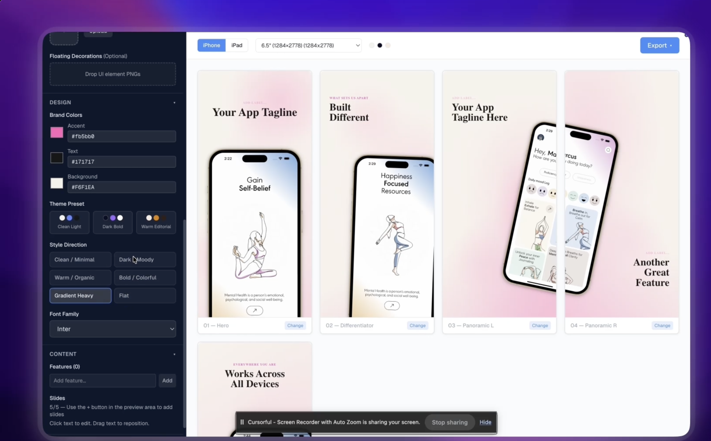
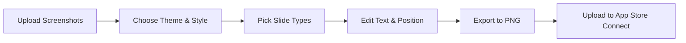

<div align="center">

# 📱 App Store Screenshot Generator

### Create stunning, professional App Store screenshots in seconds — completely free.

**No watermarks · No sign-up · 100% open source**

[](https://nextjs.org/)
[](https://react.dev/)
[](https://www.typescriptlang.org/)
[](https://tailwindcss.com/)
[](LICENSE)

<br />



<br />

[**🚀 Try Live Demo**](#getting-started) · [**📖 Documentation**](#features) · [**🐛 Report Bug**](../../issues) · [**💡 Request Feature**](../../issues)

</div>

---

## 🤔 Why This Exists

Indie developers spend **hours in Figma** crafting App Store screenshots — or pay **$50–$200+** for tools like AppMockUp, Screenshots Pro, or LaunchMatic. Most free tools slap on watermarks or gate features behind paywalls.

**This changes that.** A fully-featured, browser-based screenshot generator that rivals paid tools — and it's **free forever**.

> Stop wasting time on screenshots. Start shipping your app.

---

## ✨ Features

<table>
<tr>
<td width="50%">

### Professional Design System
- **3 curated themes** — Clean Light, Dark Bold, Warm Editorial
- **6 style presets** — Minimal, Moody, Organic, Colorful, Gradient, Flat
- **Custom brand colors** — accent, text, and background
- **10 premium Google Fonts** — Inter, Poppins, Space Grotesk, and more

</td>
<td width="50%">

### Pixel-Perfect Export
- **Exact App Store Connect dimensions** from 5.5" to 6.9" iPhone
- **iPad support** — 10.5" to 13" iPad Pro M4
- **High-res PNG export** — individual or batch
- **No compression, no quality loss**

</td>
</tr>
<tr>
<td width="50%">

### 7 Slide Types
- **Hero** — App icon + tagline + phone mockup
- **Differentiator** — What makes your app unique
- **Ecosystem** — Two-phone layout for multi-device
- **Feature Spotlight** — Single feature showcase
- **Trust Signal** — Bold text-only identity slide
- **More Features** — Feature pill grid
- **Panoramic Pair** — Connected dual-slide flow

</td>
<td width="50%">

### 🛠️ Built for Speed
- **Inline text editing** — click to edit directly on slides
- **Drag-to-reposition** text anywhere on the canvas
- **Screenshot assignment** — map screenshots to specific slides
- **Real-time preview** — see changes instantly
- **Export all slides** with one click

</td>
</tr>
</table>


### 🎭 Decorative Elements

Upload custom UI elements (badges, icons, floating components) and let the engine layer them with **gradient blobs**, **glow orbs**, and **device shadows** that adapt to your chosen style preset.

---

## 🚀 Getting Started

### Prerequisites

- [Node.js](https://nodejs.org/) 18+ 
- npm, yarn, pnpm, or bun

### Installation

```bash
# Clone the repository
git clone https://github.com/YOUR_USERNAME/appstore_screenshot_creator.git

# Navigate to the project
cd appstore_screenshot_creator

# Install dependencies
npm install

# Start the development server
npm run dev
```

Open [http://localhost:3000](http://localhost:3000) and start creating! 🎉


> The app works perfectly fine without Firebase — analytics are completely optional.

---

## 📱 Supported Export Sizes

| Device | Size | Resolution |
|--------|------|-----------|
| iPhone 16 Pro Max | 6.9" | 1320 × 2868 |
| iPhone 15 Pro Max | 6.7" | 1290 × 2796 |
| iPhone 15/14 Pro | 6.1" | 1179 × 2556 |
| iPhone (6.5") | 6.5" | 1284 × 2778 |
| iPhone (6.5" alt) | 6.5" | 1242 × 2688 |
| iPhone X/XS | 5.8" | 1125 × 2436 |
| iPhone 8 Plus | 5.5" | 1242 × 2208 |
| iPad Pro M4 | 13" | 2064 × 2752 |
| iPad Pro | 12.9" | 2048 × 2732 |
| iPad Pro | 11" | 1668 × 2388 |
| iPad | 10.5" | 1668 × 2224 |

All sizes match **Apple's official App Store Connect requirements**.

---

## 🏗️ Architecture

```
app/
├── page.tsx                    # Main dashboard entry
├── layout.tsx                  # Root layout with Geist font
├── globals.css                 # Design tokens + Tailwind
├── lib/
│   ├── firebase.ts             # Firebase config (optional)
│   └── analytics.ts            # Event tracking
└── components/
    ├── context/
    │   └── DashboardContext.tsx # Global state (useReducer)
    ├── canvas/
    │   ├── PreviewGrid.tsx      # Slide grid + add button
    │   ├── ScreenshotPreview.tsx # Individual slide card
    │   ├── OffscreenRenderer.tsx # Hidden render target for export
    │   ├── ScreenshotAssigner.tsx
    │   └── SlideDesignPicker.tsx # Slide type selector modal
    ├── slides/
    │   ├── HeroSlide.tsx
    │   ├── DifferentiatorSlide.tsx
    │   ├── EcosystemSlide.tsx
    │   ├── CoreFeatureSlide.tsx
    │   ├── TrustSignalSlide.tsx
    │   ├── MoreFeaturesSlide.tsx
    │   ├── PanoramicSlide.tsx
    │   ├── DraggableCaption.tsx
    │   └── SlideWrapper.tsx
    ├── sidebar/
    │   ├── Sidebar.tsx          # Collapsible config panel
    │   ├── ScreenshotUploader.tsx
    │   ├── IconUploader.tsx
    │   ├── UIElementUploader.tsx
    │   ├── ColorPicker.tsx
    │   ├── ThemeSelector.tsx
    │   ├── StyleSelector.tsx
    │   ├── FontSelector.tsx
    │   ├── FeatureListEditor.tsx
    │   ├── LocaleManager.tsx
    │   └── SlideCountSelector.tsx
    ├── toolbar/
    │   └── Toolbar.tsx          # Device + size + export controls
    ├── mockups/
    │   ├── Phone.tsx            # iPhone frame component
    │   └── IPad.tsx             # iPad frame component
    ├── decorative/
    │   ├── GradientBlob.tsx     # Background decoration
    │   └── GlowOrb.tsx         # Accent glow effect
    ├── typography/
    │   └── Caption.tsx          # Slide text renderer
    ├── export/
    │   └── useExport.ts         # PNG export via html-to-image
    ├── constants.ts             # Themes, sizes, configs
    └── types.ts                 # TypeScript interfaces
```

---

## 🎯 How It Works



1. **Upload** your app screenshots and icon
2. **Customize** theme, style preset, brand colors, and font
3. **Build** your slide deck from 7 professional slide templates
4. **Edit** headlines inline — click to type, drag to reposition
5. **Export** pixel-perfect PNGs at exact App Store dimensions
6. **Upload** directly to App Store Connect

---

## Tech Stack

| Technology | Purpose |
|-----------|---------|
| **Next.js 16** | App framework with App Router |
| **React 19** | UI rendering |
| **TypeScript** | Type safety |
| **Tailwind CSS 4** | Utility-first styling |
| **html-to-image** | Client-side PNG export |
| **Firebase** | Analytics (optional) |
| **Geist Font** | Default typography |

---

## Contributing

Contributions are what make the open-source community amazing. Any contributions you make are **greatly appreciated**.

1. **Fork** the project
2. **Create** your feature branch (`git checkout -b feature/amazing-feature`)
3. **Commit** your changes (`git commit -m 'Add amazing feature'`)
4. **Push** to the branch (`git push origin feature/amazing-feature`)
5. **Open** a Pull Request

### Ideas for Contributions

- [ ]  More theme presets (neon, pastel, monochrome)
- [ ]  More slide templates (testimonial, pricing, comparison)
- [ ]  Slide reordering via drag-and-drop
- [ ]  Gradient background editor
- [ ] Mac App Store screenshot support

---

## ⭐ Support

If this tool saved you time (or money), consider:

- ⭐ **Starring this repo** — it helps others discover it
- 🐛 **Reporting bugs** — helps make it better for everyone
- 📢 **Sharing on Twitter/X** — spread the word to other indie devs
- 🛠️ **Contributing** — PRs are always welcome

---

## 📜 License

Distributed under the **MIT License**. See [`LICENSE`](LICENSE) for more information.

Use it freely for personal and commercial projects. No attribution required (but appreciated! 💜).

---

## 🙏 Acknowledgments

- [Next.js](https://nextjs.org/) — The React framework for production
- [html-to-image](https://github.com/bubkoo/html-to-image) — Client-side image generation
- [Geist Font](https://vercel.com/font) — Beautiful typography by Vercel
- [Google Fonts](https://fonts.google.com/) — Premium fonts for every style
- Apple's [App Store Connect](https://developer.apple.com/app-store-connect/) — Screenshot spec reference

---

<div align="center">

**Built with ❤️ for indie developers everywhere.**

<br />

<sub>If a paid tool can do it, an open-source one should too.</sub>

</div>
